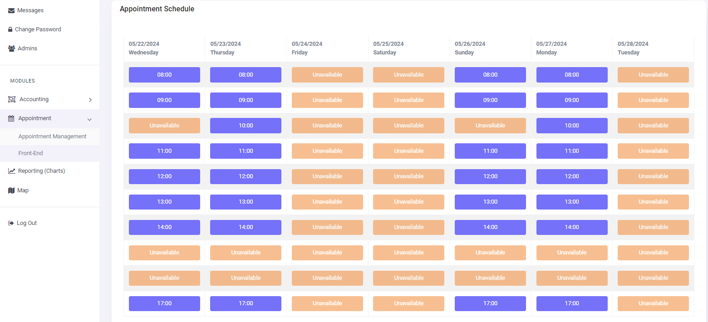
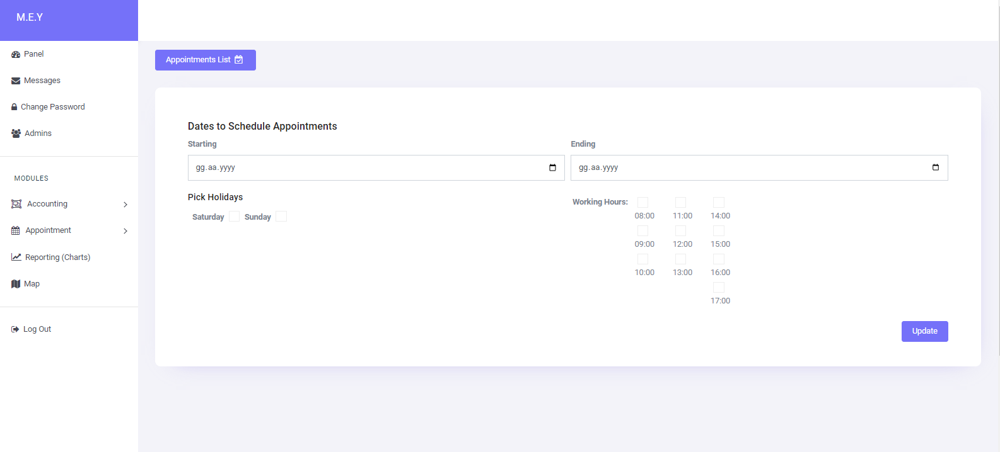

# CodeIgniter 3 Starter Kit

Codeigniter3 Starter Kit with most required modules

[](LICENSE)

## Table of Contents

- [About](#about)
- [Features](#features)
- [Installation](#installation)
- [Usage](#usage)
- [Contributing](#contributing)
- [License](#license)

## About

This project provides a starter kit based on CodeIgniter 3. With this kit, you can quickly start your projects and set up basic configurations efficiently.

## Features

- Simple and clear file structure
- Basic Messages Module
- Change password
- Manage users
- Map Module
- Appointment Module
- Reporting (Charts) Module
- Pre-Accounting Module


## Installation

Follow the steps below to set up the project:

1. **Clone the repository:**

    ```bash
    git clone https://github.com/username/codeigniter3-starter-kit.git
    cd codeigniter3-starter-kit
    ```

2. **Database connection**

You should create a database and import the .sql file provided.


3. **Start the application:**
 You can freely use this kit to build your project faster!

## Usage

You can reach every feature with UI.

## Contributing

If you want to contribute, please follow these steps:

1. Fork the repository
2. Create a new branch (`feature/name`)
3. Commit your changes (`git commit -am 'Add new feature'`)
4. Push to the branch (`git push origin feature/name`)
5. Create a Pull Request

## License

This project is licensed under the MIT License - see the [LICENSE](LICENSE) file for details.


## Media








